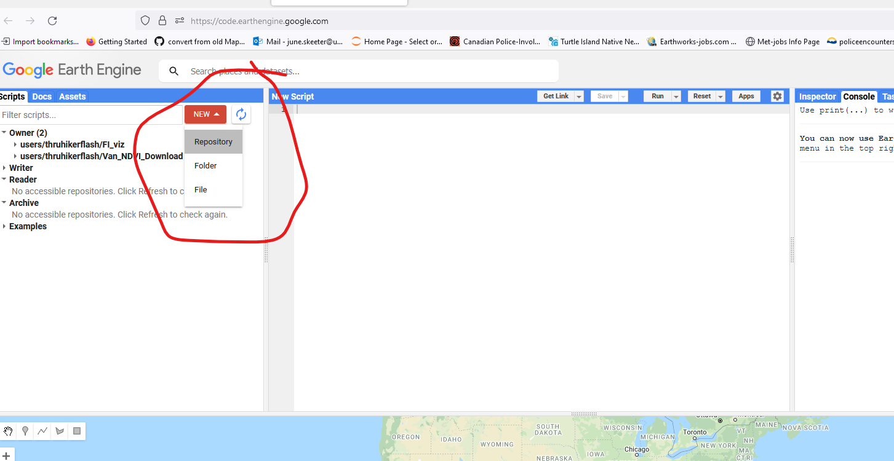

<details open markdown="block">
  <summary>
    Table of contents
  </summary>
  {: .text-delta }
1. TOC
{:toc}
</details>
---


# Monitoring Vegetation with Satelites

We're going to work with [LANDSAT8](https://developers.google.com/earth-engine/datasets/catalog/landsat-8) data in this lab.  LANDSAT8 is one of a large number of satellites that orbit the earth continuously collecting multi-spectral (visible light & other wavelengths) imagery.  We can use multi-spectral imagery for a number of different applications like estimating vegetation health.

The lines on the chart below are referred to as a spectral reflectance curves. They show reflectance (amount of light) on the y-axis, defined as the percent of radiation reflected by different earth features, and wavelength on the x-axis. As you can see, the spectral reflectance curves for different features look very different. Specifically, you can see that healthy green vegetation has very high reflectance in the near-infrared wavelengths (0.7-1.4 µm) and lower reflectance in the visible part of the spectrum (0-0.7 µm), while water absorbs almost all incoming infrared radiation and thus has very low infrared reflectance. Soil has relatively higher reflectance in the visible wavelengths, and intermediate reflectance in the near infrared.
 
<div style="overflow: hidden;
  padding-top: 56.25%;
  position: relative">
  <iframe src="content/images/NDVI.png" title="Processes" scrolling="no" frameborder="0"
    style="border: 0;
   height: 100%;
   left: 0;
   position: absolute;
   top: 0;
   width: 100%;">
   <p>Your browser does not support iframes.</p>
 </iframe>
</div>
<a href="content/images/NDVI.png" target="_blank">View Image in New Tab</a>

## Calculating NDVI

These differences are the basis for the normalized difference vegetation index (NDVI), one of the most commonly used spectral indices for vegetation monitoring. NDVI is calculated as:


$$
NDVI = \frac{(NIR-Red)}{(NIR+Red)}
$$

where NIR is reflectance in the near-infrared wavelengths, and RED is reflectance in the red wavelengths. This index can range from -1 to 1, with higher values indicating more/greener/healthier vegetation. Look at the graph above and make sure you understand why green vegetation would have a high value of NDVI.

The gray shaded areas indicate regions of the electromagnetic spectrum that are measured by a satellite. These regions are referred to as “spectral bands.” When you work with satellite imagery, you will have one raster for each band. The values for each raster contain the reflectance measured by the satellite in that band. (This will make more sense in a minute, when you start working with the satellite data).

# Using Google Earth Engine


**1**{: .label .label-red } Go to the [GEE code Explorer](https://code.earthengine.google.com/), log in if you need to, and create a new Repository called **Van_NDVI_Download**.




**2**{: .label .label-red } Now create an New File, make sure its located within the Van_NDVI_Download repository you just created, and name it **Landsat8_NDIV_Download**.


**3**{: .label .label-red } Copy the following Javascript code from in the grey box below and paste it into the code pane (top middle).

```javascript
// Coordinates for Vancouver
var Cent = ee.Geometry.Point([-123,49.25]);

// Center Map on Vancouver
Map.centerObject(Cent, 10);

// Import the Landsat 8 TOA image collection.
var Collection = ee.ImageCollection('LANDSAT/LC08/C01/T1_TOA').filter(ee.Filter.lt('CLOUD_COVER_LAND', 10));

// Get the number of images.
var count = Collection.size();
print('Count: ', count);

// Define NDVI Function
var addNDVI_Landsat = function(image) {
  var ndvi = image.normalizedDifference(['B5', 'B4']).rename('NDVI');
  return image.addBands(ndvi);
};

// Apply Function to all Images
var withNDVI_Landsat = Collection.map(addNDVI_Landsat);

// Make a "greenest" pixel composite.
var greenest = withNDVI_Landsat.qualityMosaic('NDVI');
var ndvi = greenest.select('NDVI')

// Define Color Scheme for Visualization
var ndviParams = {min: -.5, max: 1, palette: ['blue', 'white', 'green']};

// Display the result.
Map.addLayer(ndvi, ndviParams, 'Greenest pixel composite');

// // Export to Google drive
// Export.image.toDrive({
//   image: ndvi,
//   description: 'Van_Greenest',
//   scale: 30,
//   region: Boundary
// });
```

**3**{: .label .label-red } Click **Run** and see take note of what happens.  Reference the video below if you have trouble.

* Google quickly processes your request and adds the image to your screen.  You can change the transparency or turn the image on/off with the check box.
* This image is a "Greenest Pixel" - the code queries all LANDSAT8 data, calculates NDVI for every location in the map view, and then selects the maximum NDVI value at each location, which represents the peak greenness (across all seasons/years) and adds it to the image!
* Zoom and pan a bit to explore!

<div style="overflow: hidden;
padding-top: 56.25%;
position: relative">
<iframe src="content/videos/RunCode.mp4" title="Processes" scrolling="no" frameborder="0"
  style="border: 0;
 height: 100%;
 left: 0;
 position: absolute;
 top: 0;
 width: 100%;">
 <p>Your browser does not support iframes.</p>
</iframe>
</div>
<a href="content/videos/RunCode.mp4" target="_blank">View Image in New Tab</a>


<!-- 
### WA1
What is NDVI and what is it used for?  Describe the patterns you see in NDVI across the metro Vancouver area. -->

<!-- NDVI is a metric for gauging vegetation health/density/"greenness".  It is based off the differential reflectivity between red (low for plants) and near infrared (high for plants).  Across metro van - water/concrete low, residential w/ tree cover medium, forests/agriculture high -->

# Downloading the Data

Below are the steps to download the NDVI data.  You can reference the videos below for help.  **Note** the export dialog has changed slightly since the video was recorded (see screenshot below video).

**1**{: .label .label-green } Upload the Boundary file.
* Go to the Assets tab (top left)
* Click New > Shape files
* Navigate to your Van_NDVI folder and upload the Boundary file you created.
  * Try to upload all the files named Boundary.  GEE will tell you which (eg. .sbx) file types it won't accept.  Exclude them and upload the rest
* Click refresh to see your upload
  * It may take a few minutes to show up, the video has been edited for brevity

**2**{: .label .label-green } Import the Boundary file into the code.
* Click on the boundary file you uploaded, and select import.
* It will import in the top of the code window.
  * By default it names it "table", change the name to Boundary.

**3**{: .label .label-green } Run the download.
* Scroll to the bottom of the code.
* In Javascript the double backslash "//" will "comment out" code or text so that it is ignored by the processor.
  * Highlight the commented out section of code and hit "ctrl + /" to get rid of the double back slashes.
  * Alternatively, you can just manual delete the double back slashes.
* Click Run
* Switch to the Task pane in the top right.  Run the Van_Greenest task to export this layer to your Google Drive.
  * Google Drive is a free (15GB) file storage service that comes with a Google account.  

<div style="overflow: hidden;
  padding-top: 56.25%;
  position: relative">
  <iframe src="content/videos/GEE.mp4" title="Processes" scrolling="no" frameborder="0"
    style="border: 0;
   height: 100%;
   left: 0;
   position: absolute;
   top: 0;
   width: 100%;">
   <p>Your browser does not support iframes.</p>
 </iframe>
</div>
<a href="content/videos/GEE.mp4" target="_blank">View Image in New Tab</a>


## Retrieve the Download

Go to your [Google Drive](https://drive.google.com/drive/my-drive) and find the Van_Greenest.tif, it should be located in the root folder.  It could take 5/10 minutes for GEE to process your request.  Right click on it to download it an put it in your Van_NDVI folder.


# Project the Raster Layer

By default, data from GEE is not projected!  It comes in the WGS 1984 Geographic Coordinate System (Lat/Lon referencing the WGS 1984 Datum).  We need to get it into NAD 1983 UTM Zone 10N so it matches the rest of our data!  Feature Datasets only work for **Vector** data.  The NDVI data is in the **Raster** data format. So we have to reproject it manually.  Raster data requires a slightly different tool to do the re-projection than the vector data we worked with in Module 1.  The steps and video below goes shows you how to do that.

**1**{: .label .label-blue } In the Geoprocessing pane, search for the Project Raster tool.

**2**{: .label .label-blue } Set the projection to UTM Zone 10N (find in your favorites for quick access).

**3**{: .label .label-blue } After running, the Van_Greenest_ProjectRaster should show up on your map.

<div style="overflow: hidden;
  padding-top: 56.25%;
  position: relative">
  <iframe src="content/videos/ProjectRaster.mp4" title="Processes" scrolling="no" frameborder="0"
    style="border: 0;
   height: 100%;
   left: 0;
   position: absolute;
   top: 0;
   width: 100%;">
   <p>Your browser does not support iframes.</p>
 </iframe>
</div>
<a href="content/videos/ProjectRaster.mp4" target="_blank">View Image in New Tab</a>

# Save Your Project!

Now would be a good time to save your project!
