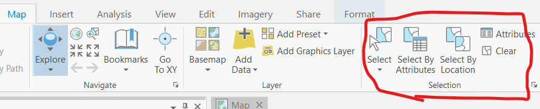

  

    Table of contents
  

  {: .text-delta }
1. TOC
{:toc}

---

# Spatial Analysis
{: .no_toc }

A key aspect of GIS is overlaying multiple data layers to generate new information.  There are typically multiple solutions to a given problem in GIS.  Here, we are going to look at two methods for combining a raster image and a vector layer:

1) **Zonal Statistics**:  This method is slightly faster, but can be applied in a more limited number of circumstances.  

2) **Raster to Polygon Conversion**: This method involves converting between data types and requires more a few steps, but it is more flexible.

# Clear Your Selection

Before proceeding with these step **Clear your Selection** in Van_DA_2016.  This is an important pitfall that commonly trips people up.  **Always** check if you have an active selection. If things don't work how you expect them too!
* If you still have rows selected, they will appear in cyan in the when the layer is turned on.  When you have a selection, and try to run a process, ArcPro will only run the process on the selected records.  We want to run it on all records, so we must hit clear selection first!
* You can clear the selection by clicking the "Clear" button found on the Map ribbon at the top.

# Zonal Statistics

We are going to overlay the vector data on the raster data to measure the mean NDVI value for each DA in the city of Vancouver using the **Zonal Statistics as Table** tool.  Then we will **Join** the resulting output table to display the mean NDVI values per DA.  A join is a way to add tables to a layer based on a specific column.

**1**{: .label .label-red } Find the Zonal Statistics as Table tool in the Geoprocessing pane, choose **Van_DA_2016** as the feature zone data, and **Van_Greenest_ProjectRaster** as the Input value raster. 
* Set DAUID as the Zone Field
* Select All statistics types
* Run

**3**{: .label .label-red } Right click on Van_DA_2016 and choose Joins and Relates > Add Join.  
* Set DAUID as the Input Join Field
* Choose the Zonal Statistics table as your input. *(the name should look something like ZonalST_Van_DA_1)*
* Make sure DAUID is selected as the Join Table Field as well
* Click OK

**3**{: .label .label-red } Inspect the Join
* Open the attribute table and note the new columns at the end
* Change the symbology, and choose Mean as the Field
* Zoom in, turn Van_DA_2016 layer on/off, compare to the classification, NDVI layer, and base map.  Confirm the values make sense given the inputs

  <iframe src="content/videos/ZonalStats.mp4" title="Processes" scrolling="no" frameborder="0"
    style="border: 0;
   height: 100%;
   left: 0;
   position: absolute;
   top: 0;
   width: 100%;">
   
Your browser does not support iframes.

 </iframe>

<a href="content/videos/ZonalStats.mp4" target="_blank">View Image in New Tab</a>

<!-- 
### QA5
What is the DAUID of the DA with the highest Mean NDVI value?  *Hint* Double clicking on Green Veg Area in the attribute table allows you to sort in ascending/descending order.
 -->

# Raster to Polygon Conversion

We are going to convert the Classification raster layer to a vector layer.  Then we can overlay the resulting vector layer with the Van_DA_2016 layer using an intersect and identify the total green vegetation area per DA.

**1**{: .label .label-blue } Find the **Raster to Polygon** tool in the geoprocessing pane.
* Set the Classified NDVI image as the Input raster
* Choose Value as the Field
* You can just accept the default name, this is only an intermediate step.

**2**{: .label .label-blue } Set the Symbology to Unique Values and choose gridcode as the Field
* Zoom into somewhere of interest (eg. I chose Trout Lake), toggle the newly created vector layer on and off to see if it makes sense.

  <iframe src="content/videos/RasterToPoly.mp4" title="Processes" scrolling="no" frameborder="0"
    style="border: 0;
   height: 100%;
   left: 0;
   position: absolute;
   top: 0;
   width: 100%;">
   
Your browser does not support iframes.

 </iframe>

<a href="content/videos/RasterToPoly.mp4" target="_blank">View Image in New Tab</a>

## Intersect
The [Intersect tool](https://pro.arcgis.com/en/pro-app/latest/tool-reference/analysis/intersect.htm) is one of the most useful vector - vector overlay operations.  It will combine the feature classes where they overlap and exclude all other areas.  We'll talk a lot more about this tool and other options down the line in Module 4

**3**{: .label .label-blue } Find the Intersect tool in the geoprocessing pane.  Set Van_DA_2016 and the output from the raster to polygon conversion as the inputs.  Then click run.

* Change the symbology and open the attribute table to confirm the results look like what we'd expect.

  <iframe src="content/videos/Intersect.mp4" title="Processes" scrolling="no" frameborder="0"
    style="border: 0;
   height: 100%;
   left: 0;
   position: absolute;
   top: 0;
   width: 100%;">
   
Your browser does not support iframes.

 </iframe>

<a href="content/videos/Intersect.mp4" target="_blank">View Image in New Tab</a>

## Add & Calculate Field

Adding new fields to our attribute table allows us to perform calculations or copy a subset of our data to a new column.

**4**{: .label .label-blue } In the Van_DA_2016_Intersect attribute table, click Field: **Add**.
* Name the field Green_Veg_Area and give it an alias without the underscores.
  * Arc doesn't allow spaces in column names.
* Make sure the data type is **Double**.
  * Double is a type of data that allows for decimals.  The default is "Long", which is an integer (no decimals) but we want decimals!
* Make sure to save the field then close the field window and go back to the attribute table.

**5**{: .label .label-blue } Choose Select by Attribute and set your query to: Where gridcode is equal to 3.
* Our condition is that gridcode (attribute from the NDVI layer representing vegetation category) is equal to 3 (green vegetation).

**6**{: .label .label-blue } Right click on Green Veg Area and choose **Calculate Field**.  This allows us to define a function and apply it to the table.
* Set the expression to: Green_Veg_Area = Shape_Area 
  * *Note 1* you only need to complete the right side of the equation 
  * *Note 2* If you are unable to click the **Calculate Field** button, go to the edit tab and click edit (pencil icon).
  * This will simply copy the shape area for the green vegetation areas, we will work with a more complex expression on the next page.

**7**{: .label .label-blue } We want to assign all other rows a 0.  We can quickly invert our selection with the **Switch** button.
* Calculate the field again, but with Green_Veg_Area = 0
  * We have selected gridcode 1 & 2 (Not vegetation) so they all get zeros.

  <iframe src="content/videos/AddField.mp4" title="Processes" scrolling="no" frameborder="0"
    style="border: 0;
   height: 100%;
   left: 0;
   position: absolute;
   top: 0;
   width: 100%;">
   
Your browser does not support iframes.

 </iframe>

<a href="content/videos/AddField.mp4" target="_blank">View Image in New Tab</a>

## Summary Table

Summarizing by a field (eg. DAUID - the Dissemination Unit ID) allows us to get statistics of interest for specific columns.

**8**{: .label .label-blue } Make sure you clear the selection. Right click on DAUID in the attribute table and click Summarize.
* Set Green Veg Area as the Field and choose Sum as the statistic type.
* Make sure DAUID as the Case Field.
* The resulting table will show the total of just the green vegetation area per DA, and can be joined to the Van_DA_2016 layer.

  <iframe src="content/videos/SummaryTable.mp4" title="Processes" scrolling="no" frameborder="0"
    style="border: 0;
   height: 100%;
   left: 0;
   position: absolute;
   top: 0;
   width: 100%;">
   
Your browser does not support iframes.

 </iframe>

<a href="content/videos/SummaryTable.mp4" target="_blank">View Image in New Tab</a>

## Join the Summary Table

**9**{: .label .label-blue } Do a **Join** to add the Summary Table output to Van_DA_2016.  Following the same steps as above but use the Summary Table you just generated as the Join Table.  Now, Van_DA_2016 has "greenness" quantified by two different methods.  Method 1) gives us the average NDVI value per DA.  Method 2) gives us the total "green vegetation" area per DA.

## Data Normalization
<!-- {: .no_toc } -->

One last thing we need to do is control for any confounding factors.  For example, the DAs are different sizes.  To get a better sense of green vegetation per DA, we will Normalize the Green Vegetation area by the Shape Area of the DAs.  This is known as **Normalizing**, sometimes also referred to as standardizing.  It is the process of dividing one variable by another variable to account for their relationship.  It can help us identify patterns that might be masked by a confounding variable.  We'll discuss normalization in more depth in lecture later on in term.

**10**{: .label .label-blue } In the VanDA_2016 attribute table, add a Field called **Green_Vegetation_Fraction**.
* Give it the alias Green Vegetation Fraction.
* Make sure its type is: double.

**11**{: .label .label-blue } Use the field calculator to apply an expression to your **Green Vegetation Fraction** field.
* Divide SUM_Green_Veg_Area (yours might have a slightly different name) by the Shape_Area.  This will give us the percentage of the DA that is covered by Dense Green Vegetation.

  <iframe src="content/videos/Norm.mp4" title="Processes" scrolling="no" frameborder="0"
    style="border: 0;
   height: 100%;
   left: 0;
   position: absolute;
   top: 0;
   width: 100%;">
   
Your browser does not support iframes.

 </iframe>

<a href="content/videos/Norm.mp4" target="_blank">View Image in New Tab</a>

# Inspect and Compare the Outputs

**1**{: .label .label-green } Open the Attribute Table of VanDA_2016.  Double click on **Mean** to sort by that column in ascending/descending order.  Take note of the DAUID for of the DA with the highest value.  Do the same for **Green Veg Fraction**.  Are they the same?

**2**{: .label .label-green } Create a new Scatter plot. Set the X-axis to **Green Veg Fraction** and the Y-axis to **Mean**.  Think about the relationship between these variables and what might describe the pattern you see.

**3**{: .label .label-green } Change the Y-axis to **Income**.  Make sure to **Exclude the zeros** using the same procedure as earlier.  Look at the resulting relationship.  Is the **Green Veg Fraction** a good predictor of income?  Try changing the X-axis to **Mean** to see if it gives a better result?

<!-- 
### QA6
What is the DAUID of the DA with the highest Green Veg Area?

### QA7
Is the DA with the highest mean NDVI value the same as the DA with the greatest area of green vegetation? Y/N

### QA8
Create a scatter plot, with the Mean NDVI value (Output from Method 1) on the X-axis Green and Veg Area Sum (Output from Method 2) on the Y-axis.  What is the R2 value? 

### QA9
The r2 score indicates Mean NDVI value is [Strong/Moderate/Weak/Very Weak] predictor of Green Veg Area.

### QA10
Change the Y-axis to Income and leave the X-axis as Mean NDVI, note the R2 score.  Now change the X-axis to the Green Veg Area Sum and note the R2 score.  Which variable has a "stronger" relationship with income? [Green Veg Area/Mean NDVI]

### QA11
Are either of these variables strongly linked to income? [Yes/No/Just Mean NDIV/Just Green Veg Area] -->

